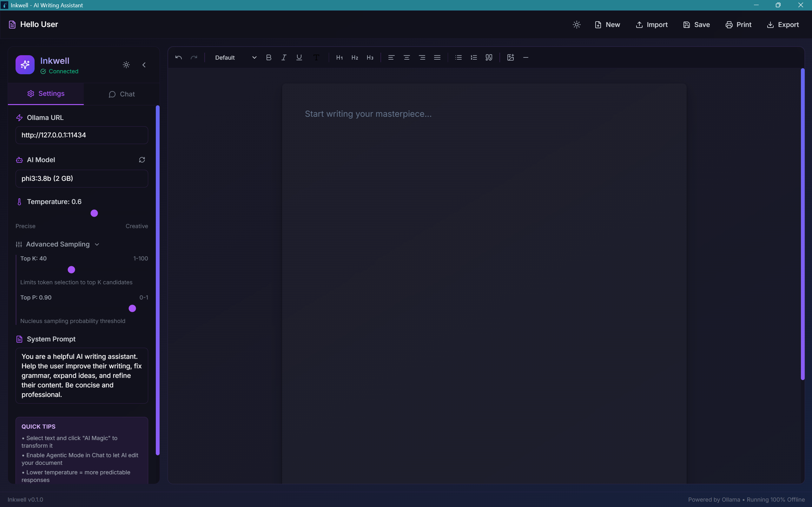

# ✨ Inkwell - AI Writing Assistant

> **A beautiful, offline-first AI writing assistant powered by local LLMs**

[](LICENSE)
[](https://github.com/Abdulkadirklc/Inkwell/releases)

[What is Inkwell?](#-what-is-inkwell) • [Features](#-features) • [Installation](#-installation) • [Usage](#%EF%B8%8F-usage) • [File Formats](#-file-formats)

---

## 🎯 What is Inkwell?

Inkwell is a desktop WYSIWYG editor that brings the power of AI to your writing workflow - **completely offline**. Using [Ollama](https://ollama.ai) to run large language models locally on your machine, Inkwell provides:

- ✅ **100% Offline** - All AI processing happens on your machine
- ✅ **Privacy First** - Your documents never leave your computer
- ✅ **No Subscriptions** - Free forever, no API keys needed
- ✅ **Cross-Platform** - Windows, macOS, and Linux support

<p align="center">
  
</p>

## ✨ Features

### 📝 Rich Text Editing
- Word-like formatting toolbar (Bold, Italic, Underline)
- Headings (H1, H2, H3)
- Text alignment (Left, Center, Right, Justify)
- Bullet and numbered lists
- Blockquotes
- **Text Color** - Customize text color
- **Images** - Drag & drop, paste, or upload; **Resizable**!
- Horizontal lines
- Undo/Redo

### 💾 Auto-Save & Recovery
- **Never Lose Work**: Your document is automatically saved as you type.
- **Session Restore**: Close the app anytime; it reopens exactly where you left off.
- **Safe New Document**: "New" button ensures you don't accidentally wipe your work.

### 🪄 AI Magic (The Core Feature!)
1. **Select any text** in your document
2. A floating menu appears with **"AI Magic"** button
3. Choose a quick command or type your own:
   - Fix Grammar
   - Improve Writing
   - Expand Text
   - Simplify
   - Make Professional
   - Or any custom command!
4. Watch as the AI **streams** the response in real-time directly on the canvas
5. Your selected text is automatically replaced, **preserving rich formatting** (Bold, Lists, Headings, etc.)

### 📚 Context Library (RAG)
New in v0.2! Give your AI knowledge about your specific documents.
1. **Upload Files**: Add PDF, Word (.docx), or Text files to the Context tab.
2. **Context-Aware Chat**: The AI automatically searches your uploaded documents to answer questions.
3. **Smart Citations**: See exactly which parts of your documents were used in the AI's response.

### 💬 AI Chat Sidebar
- **Read-Only Mode**: Ask questions about your document
- **Agentic Mode**: Let AI directly edit your document
  - "Add a conclusion to my essay"
  - "Fix all grammar mistakes"
  - "Rewrite the introduction to be more engaging"

### ⚙️ Advanced AI Settings
- **Model Selection**: Choose any Ollama model
- **Temperature**: Control creativity (0 = precise, 1 = creative)
- **Top K**: Limit token candidates
- **Top P**: Nucleus sampling threshold
- **System Prompt**: Customize AI personality

### 🎨 Theme & Layout
- **Dark Mode**: Easy on the eyes for night writing
- **Light Mode**: Clean and bright for daytime
- **Visual Pagination**: Work with A4-styled pages with visual gaps for a true print-ready experience
- **Tables**: Create and manage tables directly in the editor

### 📤 Export Options
- **Word (.docx)**: Professional export with image support and proper formatting
- **PDF**: Clean A4 PDF export with one-click generation

### 📥 Import Support
- Markdown (.md)
- HTML (.html, .htm)
- Plain text (.txt)
- Word (.docx)
- PDF (.pdf) (Context only)

---

## 📥 Installation

### Prerequisites

1. **Install Ollama** - Required for AI features
   ```bash
   # Windows (PowerShell)
   winget install Ollama.Ollama
   
   # macOS
   brew install ollama
   
   # Linux
   curl -fsSL https://ollama.ai/install.sh | sh
   ```

2. **Pull an AI model** (run after installing Ollama)
   ```bash
   # Recommended for general use (~4GB)
   ollama pull llama3.2
   
   # Smaller, faster option (~2GB)
   ollama pull phi3
   
   # Larger, more capable (~8GB)
   ollama pull llama3.1:8b
   ```

3. **Start Ollama with CORS enabled** (required for Inkwell)
   ```bash
   # Windows (PowerShell) - IMPORTANT: Run this way for Inkwell to connect
   $env:OLLAMA_ORIGINS="*"; ollama serve
   
   # macOS/Linux
   OLLAMA_ORIGINS="*" ollama serve
   ```
   
   > **Note:** The `OLLAMA_ORIGINS="*"` setting allows Inkwell to communicate with Ollama. Without this, you may see connection errors.

### Download Inkwell

#### Windows
1. Download the latest installer (`.exe` or `.msi`) from [Releases](https://github.com/Abdulkadirklc/inkwell/releases)
2. Run the installer
3. Launch "Inkwell" from Start Menu

#### macOS
1. Download the `.dmg` file from [Releases](https://github.com/Abdulkadirklc/inkwell/releases)
2. Open the DMG and drag Inkwell to Applications
3. Right-click → Open (first time only, to bypass Gatekeeper)

#### Linux
```bash
# Debian/Ubuntu (.deb)
sudo dpkg -i inkwell_0.1.0_amd64.deb

# Arch Linux (.AppImage)
chmod +x Inkwell-0.1.0.AppImage
./Inkwell-0.1.0.AppImage
```

---

## 🚀 Usage

### Getting Started

1. **Launch Inkwell** - The app opens with your last session restored.
2. **Check Connection** - Look for "Connected" status in the sidebar
   - If "Disconnected", make sure Ollama is running (`ollama serve`)
3. **Select a Model** - In Settings tab, choose an AI model
4. **Start Writing!**

### Using AI Magic

1. Type or paste text into the editor
2. **Select the text** you want to transform
3. A floating menu appears above your selection
4. Click **"AI Magic"** ✨
5. Either:
   - Click a quick command (Fix Grammar, Improve, etc.)
   - Type your own command (e.g., "Translate to Spanish")
6. Press Enter or click Send
7. Watch the AI response stream in real-time!
8. The result automatically replaces your selection

### Using Chat

1. Switch to the **Chat** tab in the sidebar
2. **Read-Only Mode** (default):
   - Ask questions: "What's the main theme of my document?"
   - Get suggestions: "How can I improve the flow?"
3. **Agentic Mode** (toggle on):
   - Give commands: "Add a bullet point summary at the end"
   - AI will directly edit your document!
   - **Note**: For best results, use a capable model like `llama3.2` or larger

### Saving Your Work

1. **Auto-Save**: You don't need to do anything! Inkwell saves automatically.
2. **Save (Ctrl+S)**: Manually save to Documents folder as HTML if you wish.
3. **Export Menu**: Choose Word, Markdown, JSON, or **PDF Document**.
4. **New Document**: Click "New" to start fresh (don't worry, it asks for confirmation).

---

## 🔧 Building from Source

### Prerequisites

- [Node.js](https://nodejs.org/) (v18+)
- [Rust](https://rustup.rs/) (latest stable)
- [Tauri Prerequisites](https://tauri.app/v1/guides/getting-started/prerequisites)

### Development

```bash
# Clone the repository
git clone https://github.com/Abdulkadirklc/inkwell.git
cd inkwell

# Install dependencies
npm install

# Run in development mode
npm run tauri dev
```

### Building for Production

```bash
# Build the application
npm run tauri build
```

Output files will be in `src-tauri/target/release/bundle/`:
- Windows: `.msi` and `.exe` installers
- macOS: `.dmg` and `.app`
- Linux: `.deb`, `.rpm`, `.AppImage`

### Sharing Inkwell

To share the app with friends or colleagues:
1. Build the app using `npm run tauri build`
2. Navigate to `src-tauri/target/release/bundle/nsis/` (on Windows for .exe)
3. Share the `.exe` setup file found there.
4. They just need to install it and (optionally) install Ollama for AI features.

---

## 📁 File Formats

### Native Format (.html)
Inkwell saves documents as HTML files, preserving all formatting.

### Word Export (.docx)
Full formatting support including:
- **Images** (with resizing)
- Headings (H1, H2, H3)
- Bold, Italic, Underline
- Text alignment
- Lists
- Blockquotes

### Markdown Export (.md)
Converts to standard Markdown:
```markdown
# Heading 1
## Heading 2
**Bold** and *italic* text
- Bullet points
> Blockquotes
```

### JSON Export
```json
{
  "title": "My Document",
  "content": "<p>HTML content...</p>",
  "exportedAt": "2024-01-01T12:00:00.000Z"
}
```

---

## 📄 License

MIT License - See [LICENSE](LICENSE) for details.

---

## 🙏 Acknowledgments

- [Tauri](https://tauri.app/) - Desktop framework
- [Ollama](https://ollama.ai/) - Local LLM runtime
- [Tiptap](https://tiptap.dev/) - Rich text editor
- [React](https://react.dev/) - UI framework
- [Lucide](https://lucide.dev/) - Beautiful icons

---

<p align="center">
  ❤️ For writers who value privacy
</p>
